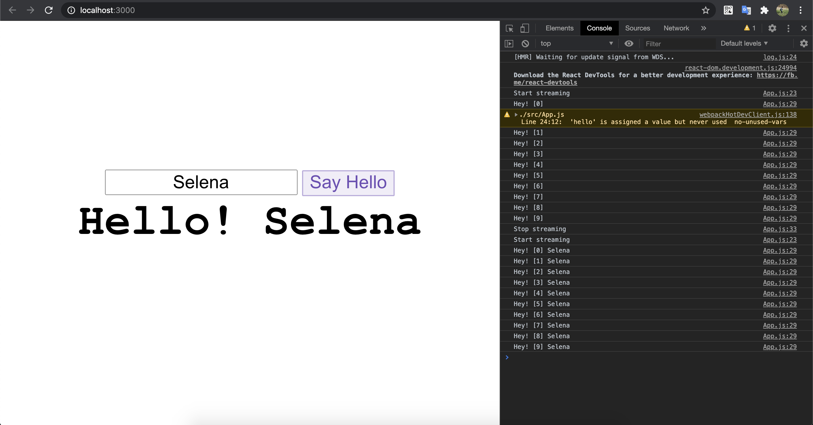

# React gRPC-Web

  [](https://github.com/ozuit/react-grpc-web/issues)

This is a demo for using gRPC-Web with the React app. This application is built on top of **create-react-app** and wrapped by [ReactRPC](https://www.npmjs.com/package/reactrpc).

## Image for running app



## Get Started

### Prerequisites

- You need to install [Docker](https://www.docker.com/get-started) in order to run the application

### Installing

- Clone this repository

### Usage

- Application has been wrapped by Docker so you need only run below command in terminal:

```bash
docker-compose up -d
```

- Access to url http://localhost:3000 to view app running

- Run below command to stop application:

```bash
docker-compose down -v
```

## Support

- If you have any problems with Web Generators don't hesitate to make an [issue](https://github.com/ozuit/react-grpc-web/issues)
- Feel free to folk and submit pull requests
- You can try to modify proto file and re-generated stub client with grpc-web by run following command:
  
```bash
./scripts/build.sh
```

## Authors

- Tan Tong
